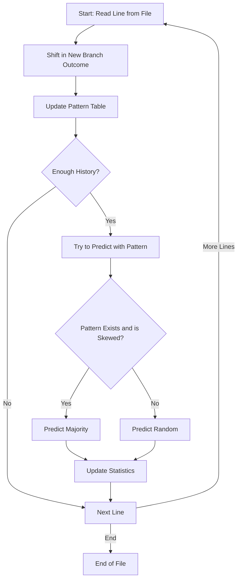
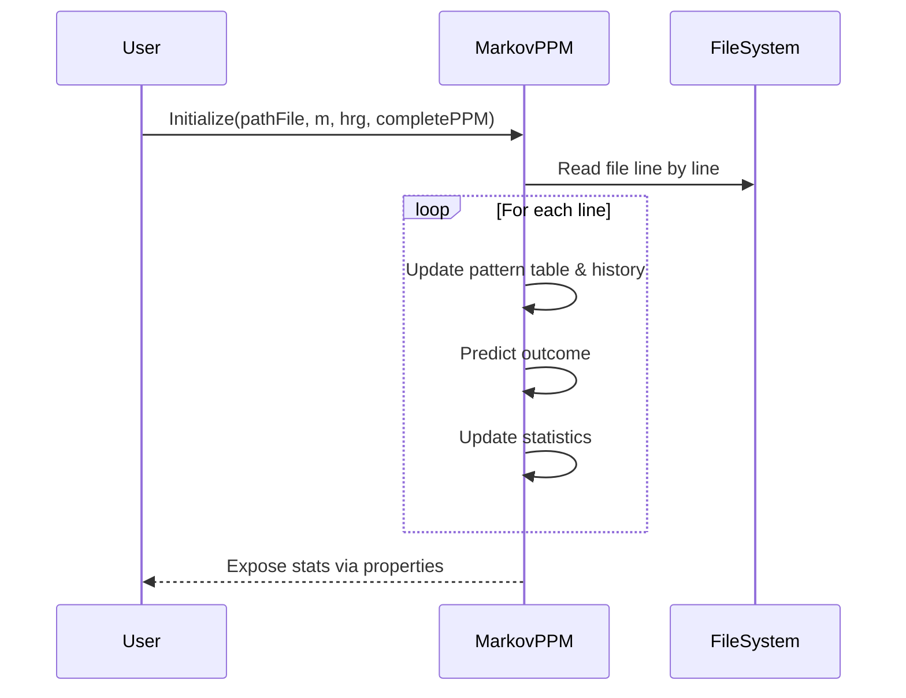

# MarkovPPM.cs Documentation

This file defines the `MarkovPPM` class, an implementation of a **Prediction by Partial Matching (PPM) Markov predictor** for binary sequences. It is designed to analyze and predict sequences of binary branch outcomes—such as those found in CPU branch prediction traces—using Markov models of configurable order.

---

## Overview

The core purpose of `MarkovPPM` is to read a file containing branch outcome data, analyze sequences of outcomes, and predict the likelihood of future outcomes based on historical context (patterns). It computes overall prediction accuracy, incorrect predictions, and maintains detailed statistics per branch.

---

## Key Concepts

- **PPM (Prediction by Partial Matching):** An advanced Markov modeling technique that uses variable-length history for prediction.
- **Binary Branch Prediction:** Each outcome is either taken (`1`) or not taken (`0`).
- **Pattern Table:** Stores observed sequences (patterns) and their counts to inform probability predictions.
- **Accuracy/Dimness:** Measures of prediction success and error.

---

## Class: MarkovPPM

The `MarkovPPM` class encapsulates all logic for reading branch trace data, learning patterns, and making predictions.

### Core Fields

| Field                | Type                               | Purpose                                                        |
|----------------------|------------------------------------|----------------------------------------------------------------|
| `branches`           | `int[]`                            | Holds recent branch history (length = order + 1)               |
| `m`                  | `int`                              | Markov model order (history length)                            |
| `hrg`                | `int`                              | Number of initial rows to skip for model warm-up               |
| `pathFile`           | `string`                           | Path to the input data file                                    |
| `completePPM`        | `bool`                             | Whether to use "complete" PPM mode                             |
| `patterns`           | `Dictionary<string, int[]>`        | Maps observed patterns to outcome counts                       |
| `rand`               | `Random`                           | For random tie-breaking                                        |
| `correctPrediction`  | `int`                              | Count of correct predictions                                   |
| `incorrectPrediction`| `int`                              | Count of incorrect predictions                                 |
| `branchesNumber`     | `int`                              | Total number of predicted branches                             |
| `accuracy`           | `double`                           | Accuracy percentage                                            |
| `dimness`            | `double`                           | 100 - accuracy (%)                                             |
| `branchInfo`         | `Dictionary<int, BranchInfo>`       | Stats for each branch program counter (PC)                     |

---

### Constructor

```csharp
public MarkovPPM(string pathFile, int m, int hrg, bool completePPM)
```
- **Initializes** the model, allocating structures and reading the input file to perform the Markov learning and prediction process.

---

## Main Process: generateMarkov

The `generateMarkov` function contains the main algorithm for learning and predicting branch outcomes.

### Step-by-Step Flow

1. **Read Input File:**  
   Reads each line, parsing the branch outcome and program counter (PC).

2. **Update History:**  
   Shifts in the new branch outcome into the history window (`branches`).

3. **Track Patterns:**  
   For each possible history pattern of length up to `m`, updates the pattern counts in `patterns`.

4. **Prediction:**  
   - If enough history is available (`branchesNumber >= m`), attempts to predict the next outcome based on observed pattern frequencies.
   - If a strong pattern exists, predict based on majority; otherwise, fall back to random or less-specific statistics.

5. **Statistics:**  
   - Updates accuracy, incorrect predictions, and per-PC stats.
   - Calculates dimness (prediction error rate).

---

## Example: Pattern Table Structure

```csharp
// Key: pattern string like "101" (last m outcomes)
// Value: int[2] where [0]=count of 0s, [1]=count of 1s following this pattern
Dictionary<string, int[]>
```

---

## Prediction Algorithm Flowchart

The diagram below visualizes the prediction process for each branch outcome:



---

## Public Properties

| Property             | Type                       | Description                                           |
|----------------------|---------------------------|-------------------------------------------------------|
| `CorrectPrediction`  | `int`                     | Number of correct predictions                         |
| `IncorrectPrediction`| `int`                     | Number of incorrect predictions                       |
| `BranchesNumber`     | `int`                     | Total branches predicted                              |
| `Accuracy`           | `double`                  | Overall accuracy (%)                                  |
| `Dimness`            | `double`                  | Error rate (100% - accuracy)                          |
| `BranchInfo`         | `Dictionary<int, BranchInfo>` | Per-branch statistics                             |

---

## Important Methods

### shiftLeft

Shifts the sliding window history array to the left and places the new outcome at the end.

```csharp
public void shiftLeft(int newValue) {
    for (int i = 0; i < m; i++) {
        this.branches[i] = this.branches[i + 1];
    }
    this.branches[m] = newValue;
}
```

---

## Per-Branch Statistics

Each branch (by its program counter, or PC) maintains additional statistics via `BranchInfo` objects:

- **TotalAccesses:** How many times this branch was seen.
- **CorrectPredictions:** How many times the model predicted this branch correctly.
- **Accuracy** and **Dimness**: Per-branch statistics.

---

## Data Flow: Markov Prediction Process



---

## Usage Example

```csharp
var predictor = new Markov.MarkovPPM("branches.txt", 4, 50, false);
Console.WriteLine($"Accuracy: {predictor.Accuracy}%");
Console.WriteLine($"Incorrect: {predictor.IncorrectPrediction}");
```

---

## Pattern Learning Logic

- **For each new outcome:**  
  - The code attempts to use the most recent `m` outcomes (history) as a pattern key.
  - If the pattern has been seen, it uses the frequency to predict.
  - If the pattern is unknown or balanced, prediction is random.

---

## Tuning Parameters

- **m:** The Markov order. Higher `m` learns longer context, but requires more data.
- **hrg:** Skips initial lines for model warm-up, avoiding cold-start bias.
- **completePPM:** If true, model is stricter and only learns as patterns are encountered.

---

## Best Practices

```card
{
    "title": "Choosing Markov Order",
    "content": "Select 'm' based on expected pattern length in your data. Too high may overfit, too low underfits."
}
```

```card
{
    "title": "Data Formatting",
    "content": "Input file lines must start with a branch type (B/N) and a program counter number, space-separated."
}
```

---

## Summary

- **MarkovPPM** efficiently learns patterns in binary sequences for prediction.
- Tracks both global and per-branch statistics.
- Fully configurable with order, warm-up, and completion mode.
- Easily integrates for branch trace analysis, prediction, or research on sequential patterns.

---

## Extensibility

You can extend `MarkovPPM` to:

- Support multi-valued outcomes.
- Add serialization for the pattern table.
- Integrate with real-time data streams.

---

## Dependencies

- **System.IO:** For file reading.
- **System.Collections.Generic:** For dictionaries and collections.
- **BranchInfo class:** (Assumed to be defined elsewhere in your project.)

---

## Limitations

- Assumes input file is well-formed.
- Only supports binary outcomes (`B`/`N`).
- Performance and memory footprint depend on pattern count and order `m`.

---

## Conclusion

`MarkovPPM` is a practical, adaptable Markov model implementation for sequential binary prediction, especially suited for branch prediction trace analysis and research. It balances flexibility with statistical rigor, and its design supports further extension as needed.

---

If you have questions about extending or using `MarkovPPM`, refer to this documentation or the source code for further exploration.